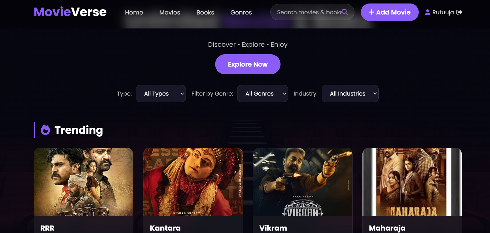
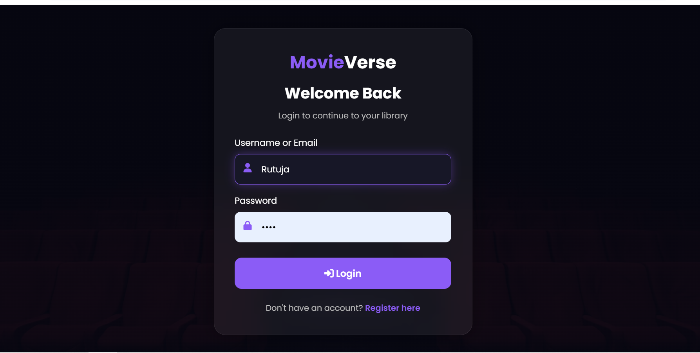
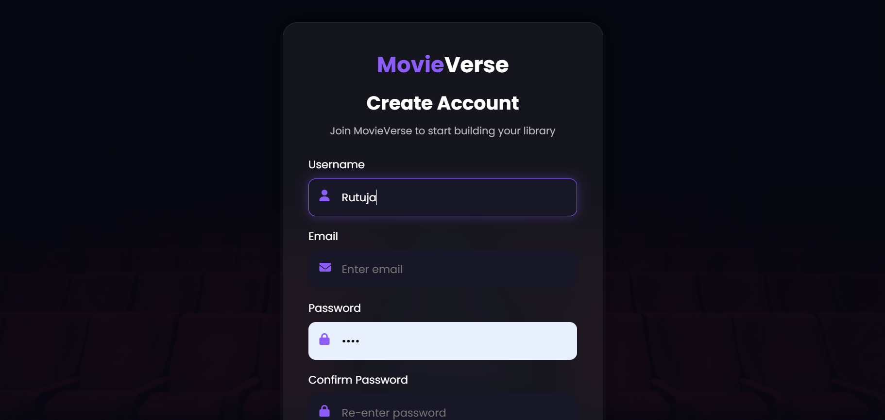
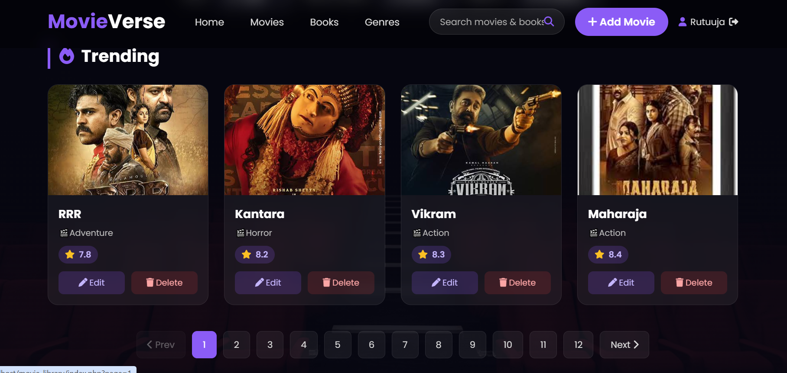

# 🎬 MovieVerse – Movie & Book Library Management System

> A modern web-based Movie & Book Library Management System built using **PHP, MySQL, HTML, CSS, and JavaScript**. The application provides an easy way to browse, search, and manage movies and books through a clean and user-friendly interface.

---

## 📖 About the Project

MovieVerse is a full-stack web application developed to simplify the management of movie and book collections. It enables users to explore the library, search for titles, and manage records efficiently.

This project was developed as part of my learning journey in web development and database management.

---

## ✨ Features

- 👤 User Registration & Login
- 🎬 Browse Movie Collection
- 📚 Browse Book Collection
- 🔍 Search Movies & Books
- ➕ Add New Records
- ✏️ Edit Existing Records
- 🗑️ Delete Records
- 💾 MySQL Database Integration
- 📱 Responsive User Interface

---

## 🛠️ Technologies Used

| Technology | Purpose |
|------------|---------|
| PHP | Backend Development |
| MySQL | Database |
| HTML5 | Structure |
| CSS3 | Styling |
| JavaScript | Client-side Functionality |
| XAMPP | Local Development Server |
| Git | Version Control |
| GitHub | Project Hosting |

---

## 📂 Project Structure

```text
MovieVerse/
│
├── css/
├── js/
├── images/
├── database/
├── index.php
├── login.php
├── register.php
├── dashboard.php
├── README.md
└── ...
```

---

## ⚙️ Installation & Setup

### 1️⃣ Clone the Repository

```bash
git clone https://github.com/RutujaKubade/MovieVerse.git
```

### 2️⃣ Move the Project

Copy the project folder into:

```
xampp/htdocs/
```

### 3️⃣ Start XAMPP

Start:

- ✅ Apache
- ✅ MySQL

### 4️⃣ Import Database

- Open **phpMyAdmin**
- Create a database
- Import the SQL file

### 5️⃣ Run the Project

Open your browser:

```
http://localhost/movie_library
```

---

## 📸 Screenshots

### 🏠 Home Page

> *(Add screenshot here)*



---

### 🔐 Login Page

> *(Add screenshot here)*



---

### 📝 Registration Page

> *(Add screenshot here)*



---


### 🎬 Movie & Book List

> *(Add screenshot here)*



---

## 🚀 Future Improvements

- ⭐ Ratings & Reviews
- 🎭 Category Filtering
- 📱 Better Mobile Responsiveness
- ☁️ Cloud Deployment
- 📧 Email Notifications

---

## 👩‍💻 Author

**Rutuja Kubade**

🎓 MCA Student

💻 Aspiring Software Developer

🔗 GitHub:
https://github.com/RutujaKubade

---

## 🤝 Contributing

Contributions, suggestions, and feedback are welcome.

If you'd like to improve this project, feel free to fork the repository and create a pull request.

---

## 📄 License

This project is developed for educational and learning purposes.

© 2026 Rutuja Kubade. All Rights Reserved.